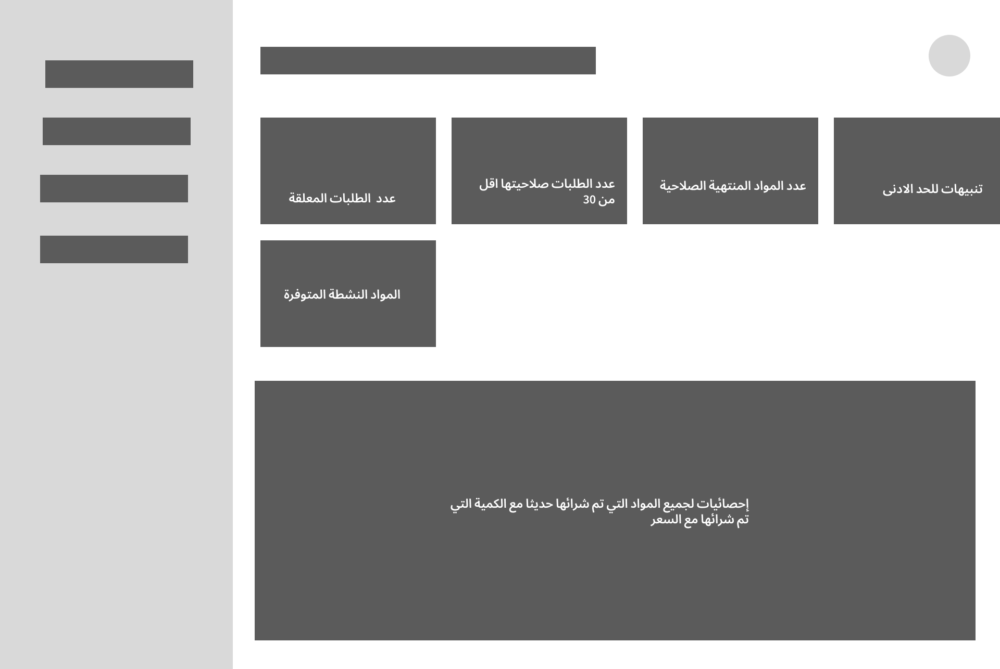
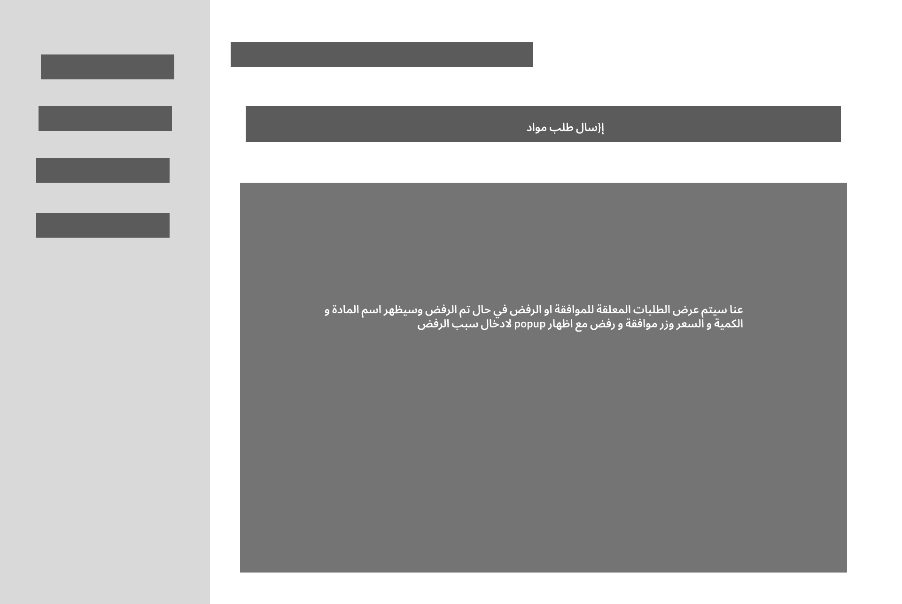
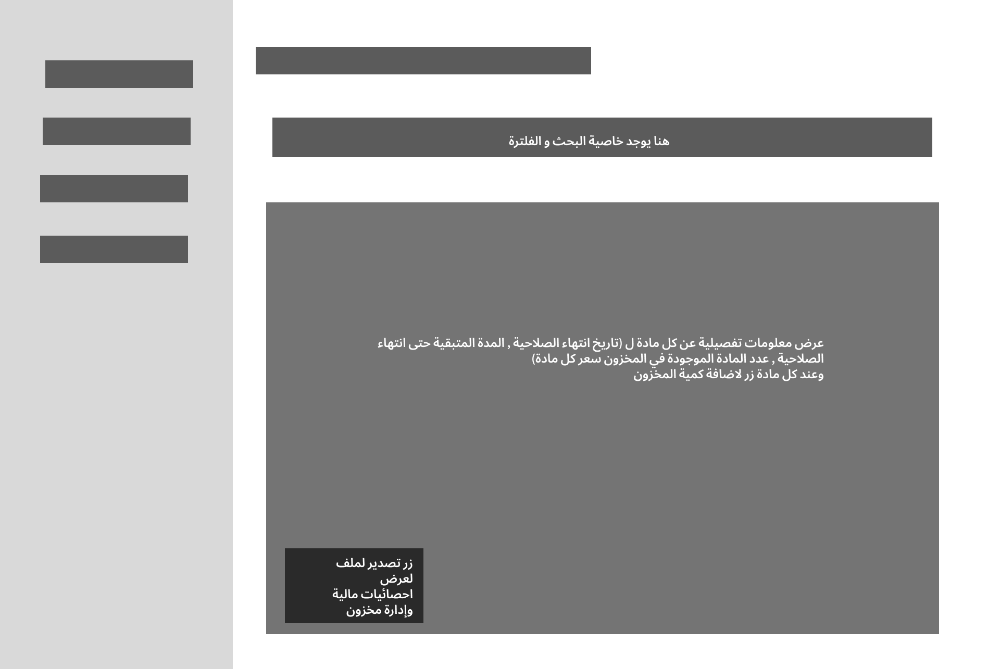

1.	واجهة المستخدم (User Interface) : 
واجهة المستخدم هي الجزء المسؤول عن التفاعل بين المستخدم و النظام , حيث تتيح للمستخدم تنفيذ العمليات المختلفة بطريقة سهلة و منظمة من خلال الشاشات و الأزرار و القوائم . 
-	يتكون نظام إدارة المخزون من ثلاث شاشت رئيسية وهي :
1-	لوحة التحكم (Dashboard)  
2-	شاشة إدارة الطلبات (Order Management Screen) 
3-	شاشة إدارة الموارد (Resource Management Screen) 
1.	لوحة التحكم (Dashboard)  :
لوحة التحكم الرئيسية للنظام حيث تعرض ملخصاً سريعاً ومباشراً لاهم المعلومات و الاحصائيات المتعلقة بإدارة المخزون مما يساعد المستخدم على متابعة حالة النظام بشكل مستمر.
وتتضمن لوحة التحكلم ما يلي:
	عدد المواد النشطة المتوفرة داخل المخزون
	عدد الطلبات المعلقة التي ما تزال قيد المعالجة
	عدد المواد المنتهية الصلاحية
	عرض المواد التي تبقى على صلاحيتها اقل من 30 يوم
	تنبيها للحد الادنى حيث تظهر المواد التي اصبحت كميتها اقل وذلك لعدم نفاذ المواد بالكامل
2.	شاشة إدارة الطلبات (Order Management Screen) :
تستخدم شاشة إدارة الطلبات لتنظيم عمليات طلب المواد و متابعتها حيث تتيح للمستخدم تقديم طلبات جديدة بالاضافة إلى متابعة حالة الطلبات المعلقة قبولها و رفضها واتخاذ اجراءات مناسبة بشأنها .
وتنقسم الشاشة إلى قسمين رئيسيين :
أولاً : قسم إضافة طلب جديد يحتوي القسم على نموذج مخصص لإرسال طلبات المواد و يتضمن العناصر التالية :
	قائمة منسدلة لاختيار اسم المادة المطلوبة.
	حقل إدخال لتحديد الكمية المطلوبة.
	زر إرسال الطلب إلى النظام
ويهدف هذا القسم إلى تسهيل  عملية إنشاء الطلبات بطريقة منظمة و سريعة مع تقليل احتمالية حدوث أخطاء أثناء الإدخال .
ثانياً : قسم الطلبات المعلقة  يعرض هذا القسم جميع الطلبات التي ما تزال قيد المراجعة او المعالجة ويتضمن المعلومات التالية لكل طلب :
	اسم المادة المطلوبة.
	تاريخ تقديم الطلب.
	الكمية المطلوبة.
	اسم مقدم الطلب
كما يحتوي كل طلب على زرين :
1-	موافقة على الطلب
2-	رفض الطلب
وعند اختيار رفض الطلب  يظهر حقل نصي لادخال سبب الرفض بهدف توثيق القرار و إبلاغ مقدم الطلب بالتفاصيل اللازمة
ويساعد هذا القسم في تحسين عملية متابعة الطلبات و تنظيمها .
3.	شاشة إدارة الموارد (Resource Management Screen) :
تستخدم شاشة إدارة الموارد ل إدارة الأدوية و الموارد المخزنة داخل النظام حيث تساعد في تنظيم بيانات المخزون و متابعة كميات و صلاحيات بشكل دقيق .
تحتوي الشاشة على مجموع من الأدوات و الوظائف المهمة منها :
1-	خاصية البحث حيث يستخدم للبحث عن دواء او مادة معينة بسهولة و سرعة 
2-	خاصية الفلترة او التصفية للبحث عن اصنافة مواد او ادوية حسب صنف معين لسهولة الوصول للمادة او الدواء بسهولة
3-	عرض معلومات تفصيلية عن كل مادة و تشمل (تاريخ انتهاء الصلاحية , المدة المتبقية حتى انتهاء الصلاحية , عدد المادة الموجودة في المخزون)
4-	ويحتوي على زر لتصدير ملف إكسل لانشاء تقرير مالية و إحصائية لمتابعة في عمليات البيع و إدارة المخزون
5-	زر تحديث المخزون و الذي يستخدم لاضافة كميات جديدة من الأدوية و المواد المتوفرة داخل المستودع للحفاظ على تحديث المواد بشكل مستمر.
-	Wireframe:
-	لوحة التحكم (Dashboard)  

-    شاشة إدارة الطلبات (Order Management Screen) 

-  شاشة إدارة الموارد (Resource Management Screen) 

https://www.figma.com/design/oohGi7dTOWP2N2MkZEuSjd/Untitled?node-id=0-1&t=p4p38MuGryggARe3-1

